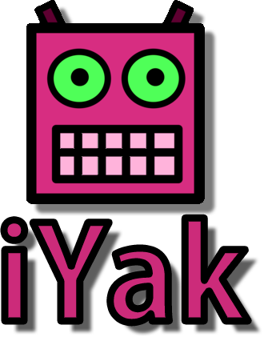
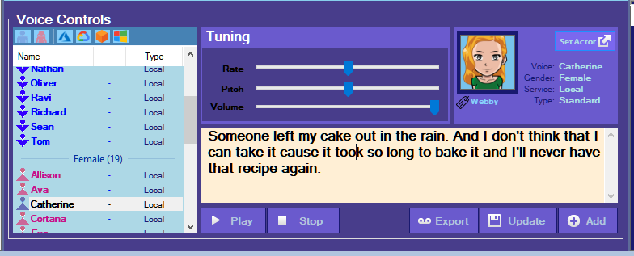

# iYak

**iYak** is a Windows application written in c# and serves as a **Text-to-speech** soundboard.

It was created to keep track of scripts/speeches and the voice settings used for characters.

It's still a WIP but a lot of the functionality is available.

---

